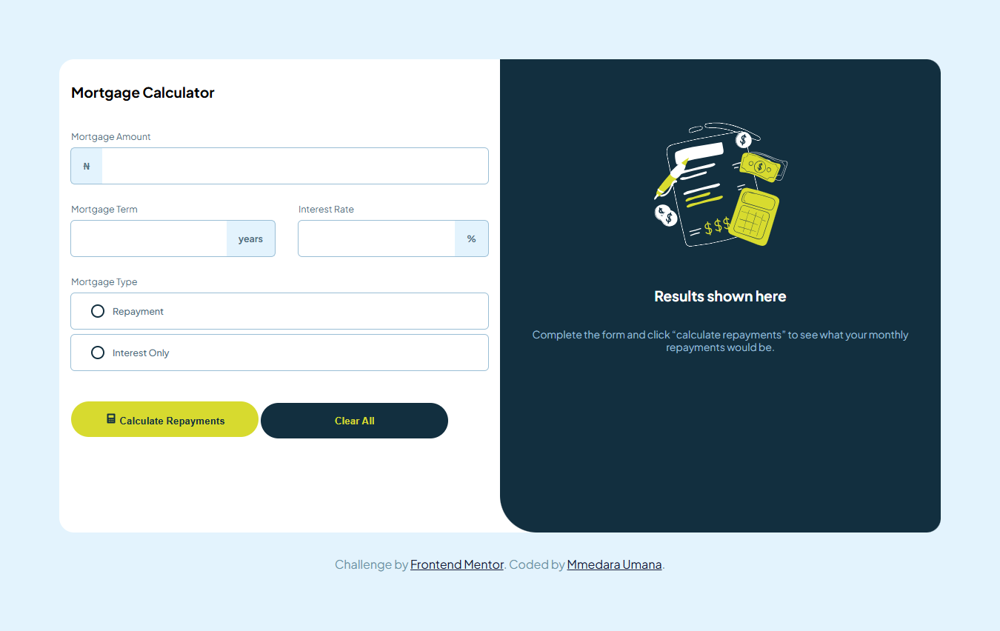
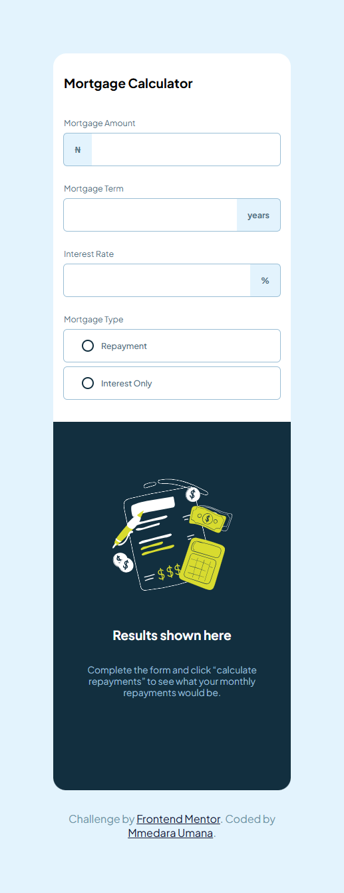

# Mortgage repayment calculator solution - Frontend Mentor

This is a solution to the [Mortgage repayment calculator challenge on Frontend Mentor](https://www.frontendmentor.io/challenges/mortgage-repayment-calculator-Galx1LXK73). Frontend Mentor challenges help you improve your coding skills by building realistic projects. 

## Table of contents

- [Mortgage repayment calculator solution - Frontend Mentor](#mortgage-repayment-calculator-solution---frontend-mentor)
  - [Table of contents](#table-of-contents)
  - [Overview](#overview)
    - [The challenge](#the-challenge)
    - [Screenshot](#screenshot)
    - [Links](#links)
  - [My process](#my-process)
    - [Built with](#built-with)
    - [What I learned](#what-i-learned)
  - [Author](#author)

## Overview

### The challenge

Users should be able to:

- Input mortgage information and see monthly repayment and total repayment amounts after submitting the form
- See form validation messages if any field is incomplete
- Complete the form only using their keyboard
- View the optimal layout for the interface depending on their device's screen size
- See hover and focus states for all interactive elements on the page

### Screenshot

### Links

- Solution URL: [Add solution URL here](https://your-solution-url.com)
- Live Site URL: [Add live site URL here](https://your-live-site-url.com)

## My process

### Built with

- Semantic HTML5 markup
- CSS custom properties
- Flexbox
- CSS Grid
- JS

### What I learned

Learnt how to really use event listeners specific to form elements. This took me so long about 2 months, and really made me doubt if I was really learning.   
To be fair, I had other things I was working on that weren't coding related but I'm still beating myself up about it.  
I'm just happy to be done, and I hate that what I feel is relief more than happiness.

## Author

- Frontend Mentor - [@MmedaraU](https://www.frontendmentor.io/profile/MmedaraU)
- Twitter - [@MmedaraUmana](https://twitter.com/MmedaraUmana)
- Github - [MmedaraU](https://github.com/MmedaraU)
